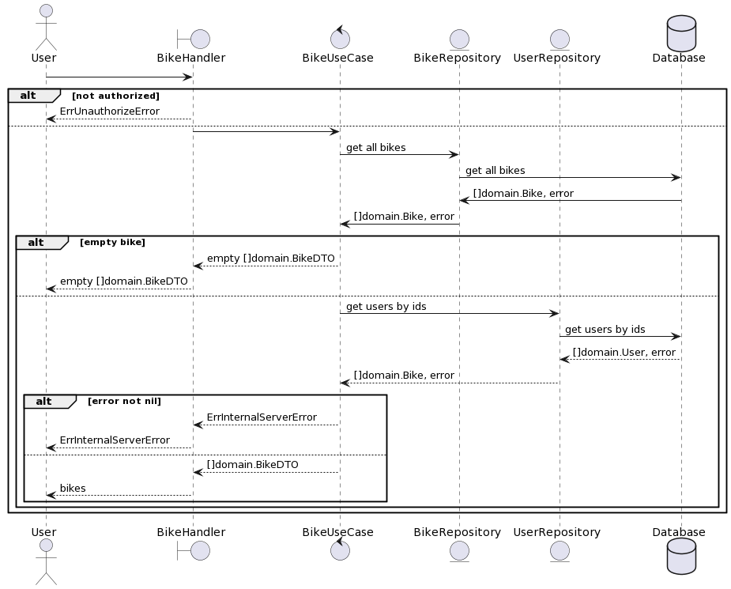
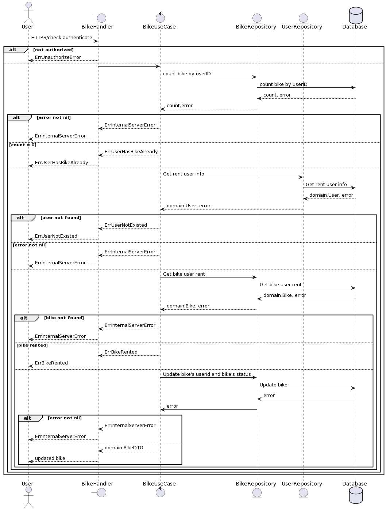
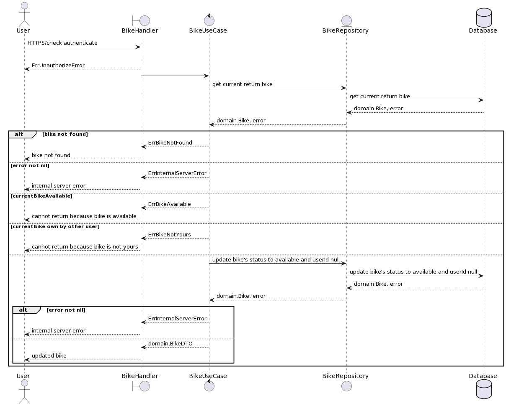

# shared-bike
## How to start projects
### By docker-compose
1. Run command `docker-compose build`
1. Run command `docker-compose up -d frontend`
1. Waiting for all services to started
1. Restart dev_api by running `docker restart dev_api` for migration of the first time
1. Wait for the project to start and access the frontend via `http://localhost:3000` and the API will serve on `http://localhost:8000`
### By machine environment
#### Start the API
1. Install MySQL by running the command `brew install mysql`
1. Start the MySQL `brew services start mysql`
1. Go to `api` folder and run the command `make install`
1. Copy `.env.sample` to `.env` file and change the `DB_CONNECTION_STRING` as your local config
1. Run DB migration command `goose -dir ./sql/migrations mysql $DB_CONNECTION_STRING up`
1. Run DB seeder command `goose -dir ./sql/migrations mysql $DB_CONNECTION_STRING up`
1. Run `make start` for starting the API service
1. Access the service swagger doc via `http://localhost:8000/swagger/index.html`

#### Start the Frontend
1. Go to `frontend` folder
1. Change the API config for the development environment in `public/config.json`
1. Run command `yarn install` for installing the dependencies
1. Run command `yarn start`
1. Access to the website via `http://localhost:3000`

## High-level solution
### Context

### Containers

### Components
## DB Diagram
## Detail API design

### User
#### Register
#### Login

### Bike
#### Get All Bikes
1. Sequence Diagram  
    
    ```ruby
      @startuml
      actor       User
      boundary    BikeHandler
      control     BikeUseCase
      entity      BikeRepository
      entity      UserRepository
      database    Database

      User -> BikeHandler
      alt not authorized
        BikeHandler --> User: ErrUnauthorizeError
      else
        BikeHandler -> BikeUseCase
        BikeUseCase -> BikeRepository: get all bikes
        BikeRepository -> Database: get all bikes
        Database -> BikeRepository: []domain.Bike, error
        BikeRepository -> BikeUseCase: []domain.Bike, error
        alt empty bike
          BikeUseCase --> BikeHandler: empty []domain.BikeDTO
          BikeHandler --> User: empty []domain.BikeDTO
        else
          BikeUseCase -> UserRepository: get users by ids
          UserRepository -> Database: get users by ids
          Database --> UserRepository: []domain.User, error
          UserRepository --> BikeUseCase: []domain.Bike, error
          alt error not nil
            BikeUseCase --> BikeHandler: ErrInternalServerError
            BikeHandler --> User: ErrInternalServerError
          else
            BikeUseCase --> BikeHandler: []domain.BikeDTO
            BikeHandler --> User: bikes
          end
        end
      end
      @enduml
    ```
1. Params
    - No parameters
1. Headers
    - `Content-type`: application/json
    - `Authorization`: Bearer {token}
1. Response
    - Status 200  
        ```json
          [
            {
              "id": 1,
              "lat": "50.119504",
              "long": "8.638137",
              "name": "henry",
              "nameOfRenter": "Bob",
              "status": "rented",
              "userId": 1,
            }
          ]
        ```
    - Status 500  
        `internal server error`
1. Response property
    - `id` is a unique id of bike
    - `lat` is latitude
    - `long` is longitude
    - `name` is the name of the bike
    - `userId` is renter id
#### Rent Bike
1. Sequence Diagram  
    
      ```ruby
      @startuml
      actor       User
      boundary    BikeHandler
      control     BikeUseCase
      entity      BikeRepository
      entity      UserRepository
      database    Database
      User -> BikeHandler : HTTPS/check authenticate
      alt not authorized
        BikeHandler --> User: ErrUnauthorizeError
      else
        BikeHandler -> BikeUseCase
        BikeUseCase -> BikeRepository: count bike by userID
        BikeRepository -> Database: count bike by userID
        Database --> BikeRepository: count, error
        BikeRepository --> BikeUseCase: count,error
        alt error not nil
          BikeUseCase --> BikeHandler: ErrInternalServerError
          BikeHandler --> User: ErrInternalServerError
        else count = 0
          BikeUseCase --> BikeHandler: ErrUserHasBikeAlready
          BikeHandler --> User: ErrUserHasBikeAlready
        else
          BikeUseCase -> UserRepository: Get rent user info
          UserRepository -> Database: Get rent user info
          Database --> UserRepository: domain.User, error
          UserRepository --> BikeUseCase: domain.User, error
          alt user not found
            BikeUseCase --> BikeHandler: ErrUserNotExisted
            BikeHandler --> User: ErrUserNotExisted
          else error not nil
            BikeUseCase --> BikeHandler: ErrInternalServerError
            BikeHandler --> User: ErrInternalServerError
          else
            BikeUseCase -> BikeRepository: Get bike user rent
            BikeRepository -> Database: Get bike user rent
            Database -> BikeRepository: domain.Bike, error
            BikeRepository --> BikeUseCase: domain.Bike, error
            alt bike not found
              BikeUseCase --> BikeHandler: ErrInternalServerError
              BikeHandler --> User: ErrInternalServerError
            else bike rented
              BikeUseCase --> BikeHandler: ErrBikeRented
              BikeHandler --> User: ErrBikeRented
            else
              BikeUseCase -> BikeRepository: Update bike's userId and bike's status
              BikeRepository -> Database: Update bike
              Database -> BikeRepository: error
              BikeRepository -> BikeUseCase: error
              alt error not nil
                BikeUseCase --> BikeHandler: ErrInternalServerError
                BikeHandler --> User: ErrInternalServerError
              else
                BikeUseCase --> BikeHandler: domain.BikeDTO
                BikeHandler --> User: updated bike
              end
            end
          end
        end
      end
      @enduml
      ```
1. Params
    - `id` bike id
1. Headers
    - `Content-type`: application/json
    - `Authorization`: Bearer {token}
1. Response
    - Status 200  
        ```json
          {
            "id": 1,
            "lat": "50.119504",
            "long": "8.638137",
            "name": "henry",
            "nameOfRenter": "Bob",
            "status": "rented",
            "userId": 1,
          }
        ```
    - Status 400  
        `invalid bike id | cannot rent because you have already rented a bike | user not exists or inactive | bike not found | cannot rent because bike is rented`
    - Status 500  
        `internal server error`
1. Response property
    - `id` is a unique id of bike
    - `lat` is latitude
    - `long` is longitude
    - `name` is the name of the bike
    - `userId` is renter id

#### Return Bike
1. Sequence Diagram  
    
    ```ruby
    @startuml
    actor       User
    boundary    BikeHandler
    control     BikeUseCase
    entity      BikeRepository
    database    Database
    User -> BikeHandler : HTTPS/check authenticate
    alt not authorized
      BikeHandler --> User: ErrUnauthorizeError
    else
      BikeHandler -> BikeUseCase
      BikeUseCase -> BikeRepository: get current return bike
      BikeRepository -> Database: get current return bike
      Database --> BikeRepository: domain.Bike, error
      BikeRepository --> BikeUseCase: domain.Bike, error
      alt bike not found
        BikeUseCase --> BikeHandler: ErrBikeNotFound
        BikeHandler --> User: bike not found
      else error not nil
        BikeUseCase --> BikeHandler: ErrInternalServerError
        BikeHandler --> User: internal server error
      else currentBikeAvailable
        BikeUseCase --> BikeHandler: ErrBikeAvailable
        BikeHandler --> User: cannot return because bike is available
      else currentBike own by other user
        BikeUseCase --> BikeHandler: ErrBikeNotYours
        BikeHandler --> User: cannot return because bike is not yours
      else
        BikeUseCase -> BikeRepository: update bike's status to available and userId null
        BikeRepository -> Database: update bike's status to available and userId null
        Database --> BikeRepository: domain.Bike, error
        BikeRepository --> BikeUseCase: domain.Bike, error
        alt error not nil
          BikeUseCase --> BikeHandler: ErrInternalServerError
          BikeHandler --> User: internal server error
        else
          BikeUseCase --> BikeHandler: domain.BikeDTO
          BikeHandler --> User: updated bike
      end
    end
    @enduml
    ```
1. Params
    - `id` bike id
1. Headers
    - `Content-type`: application/json
    - `Authorization`: Bearer {token}
1. Response
    - Status 200  
        ```json
          {
            "id": 1,
            "lat": "50.119504",
            "long": "8.638137",
            "name": "henry",
            "nameOfRenter": "Bob",
            "status": "rented",
            "userId": 1,
          }
        ```
    - Status 400  
        `invalid bike id | bike not found | cannot return because bike is available | cannot return because bike is not yours`
    - Status 500  
        `internal server error`
1. Response property
    - `id` is a unique id of bike
    - `lat` is latitude
    - `long` is longitude
    - `name` is the name of the bike
    - `userId` is renter id
## Tech stacks
### Backend
1. Golang
1. Echo Framework for API
1. MySQL for DB
1. Testing by mockery and testify

### Frontend
1. React for frontend
1. Jest for testing


## Improvement
For API to get all bikes we'll improve it to get bikes only near locations of the users by using lat and long calculation
