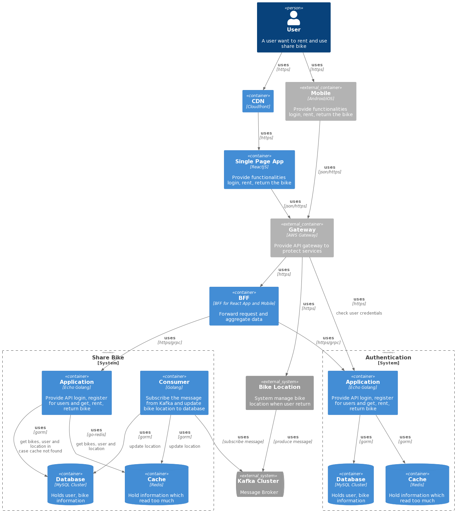

# Shared Bike system
## How to start the project
### By docker-compose
1. Run command `docker-compose build`
1. Run command `docker-compose up -d frontend`
1. Waiting for all services to start
1. Restart dev_api by running `docker restart dev_api` for migration for the first time
1. Wait for the project to start and access the frontend via `http://localhost:3000` and the API will serve on `http://localhost:8000`
### By machine environment
#### Start the API
1. Install MySQL by running the command `brew install mysql`
1. Start the MySQL `brew services start mysql`
1. Go to `api` folder and run the command `make install`
1. Copy `.env.sample` to `.env` file and change the `DB_CONNECTION_STRING` as your local config
1. Run command `export DB_CONNECTION_STRING = <value>` for migrations
1. Run DB migration command `goose -dir ./sql/migrations mysql $DB_CONNECTION_STRING up`
1. Run DB seeder command `goose -dir ./sql/seeders mysql $DB_CONNECTION_STRING up`
1. Run `make start` for starting the API service
1. Access the service swagger doc via `http://localhost:8000/swagger/index.html`

#### Start the Frontend
1. Go to `frontend` folder
1. Change the API config for the development environment in `public/config.json`
1. Run command `yarn install` for installing the dependencies
1. Run command `yarn start`
1. Access to the website via `http://localhost:3000`

## High-level solution
### Context
For the Services context, the user can register, rent and return the bikes' information

```ruby
@startuml
!include https://raw.githubusercontent.com/kirchsth/C4-PlantUML/extended/C4_Context.puml

Person(user, "User", "A user want to rent and use share bike")
System(shareBikeSystem, "Share Bike", "Allow user to register, login, rent, return the bike")
System_Ext(gpsSystem, "Bike Location", "System manage bike location when user return")

Rel(user, shareBikeSystem, "uses", "https")
Rel(gpsSystem, shareBikeSystem, "uses", "broker message")
Rel(user, gpsSystem, "uses", "https")
@enduml
```

### Containers

```ruby

@startuml
!include https://raw.githubusercontent.com/kirchsth/C4-PlantUML/extended/C4_Container.puml
Person(user, "User", "A user want to rent and use share bike")
Container(webapp, "Single Page App", "ReactJS", "Provide functionalities login, rent, return the bike")
Container_Ext(mobile, "Mobile", "Android/iOS", "Provide functionalities login, rent, return the bike")
Container_Ext(apiGateway, "Gateway", "AWS Gateway", "Provide API gateway to protect services")
System_Boundary(c1, "Share Bike") {
  Container(apiKafkaConsumer, "Consumer", "Golang", "Subscribe the message from Kafka and update bike location to database")
  Container(apiApplication, "Application", "Echo Golang", "Provide API login, register for users and get, rent, return bike")
  ContainerDb(db, "Database", "MySQL Cluster", "Holds user, bike information")
}
SystemQueue_Ext(kafka, "Kafka Cluster", "Message Broker")
System_Ext(locationService, "Bike Location", "System manage bike location when user return")

Rel(user, webapp, "uses", "https")
Rel(user, mobile, "uses", "https")
Rel(webapp, apiGateway, "uses", "json/https")
Rel(mobile, apiGateway, "uses", "json/https")
Rel(apiGateway, locationService, "uses", "https")
Rel(apiGateway, apiApplication, "uses", "https")
Rel(apiApplication, db, "uses", "gorm", "get bikes, user and location in case cache not found")
Rel(apiKafkaConsumer, db, "uses", "gorm", "update location")
Rel(apiKafkaConsumer, kafka, "uses", "subscribe message")
Rel(locationService, kafka, "uses", "produce message")
@enduml
```

### Components

```ruby
@startuml
!include https://raw.githubusercontent.com/plantuml-stdlib/C4-PlantUML/master/C4_Component.puml

Person(user, "User", "A user want to rent and use share bike")
Container(webapp, "Single Page App", "ReactJS", "Provide functionalities login, rent, return the bike")
Container_Ext(mobile, "Mobile", "Android/iOS", "Provide functionalities login, rent, return the bike")
Container_Ext(apiGateway, "Gateway", "AWS Gateway", "Provide API gateway to protect services")
ContainerDb(db, "Database", "MySQL Cluster", "Holds user, bike information")

System_Boundary(c1, "Share Bike") {
  Component(middlewareHandler, "Middleware", "Echo", "Add Request ID, Cors, Authentication")
  Component(apiKafkaConsumerHandler, "Consumer", "Golang", "Subscribe the message from Kafka and update bike location to database")
  Component(userHandler, "User Handler", "Echo", "Allow user to register, login")
  Component(userUseCase, "User UseCase", "Golang", "Provide functionalities and logic for register and login")
  Component(userRepository, "User Repository", "Golang", "Provide connector to DB for User")
  Component(bikeHandler, "Bike Handler", "Echo", "Allow user to get, rent, return bikes")
  Component(bikeUseCase, "Bike UseCase", "Golang", "Provide functionalities and logic for get, rent and return bike")
  Component(bikeRepository, "Bike Repository", "Golang", "Provide connector to DB for Bike")
}
SystemQueue_Ext(kafka, "Kafka Cluster", "Message Broker")
System_Ext(locationService, "Bike Location", "System manage bike location when user return")

Rel(user, webapp, "uses", "https")
Rel(user, mobile, "uses", "https")
Rel(webapp, apiGateway, "uses", "json/https")
Rel(mobile, apiGateway, "uses", "json/https")
Rel(apiGateway, locationService, "uses", "https")
Rel(apiGateway, middlewareHandler, "uses", json/https)

Rel(middlewareHandler, userHandler, "uses")
Rel(userHandler, userUseCase, "uses")
Rel(userUseCase, userRepository, "uses")
Rel(userRepository, db, "uses", "read and write")

Rel(middlewareHandler, bikeHandler, "uses")
Rel(bikeHandler, bikeUseCase, "uses")
Rel(bikeUseCase, bikeRepository, "uses")
Rel(bikeUseCase, userRepository, "uses", "read user information")
Rel(bikeRepository, db, "uses", "read and write")

Rel(locationService, kafka, "uses", "produce message")

Rel(apiKafkaConsumerHandler, kafka, "uses", "subscribe message")
Rel(apiKafkaConsumerHandler, bikeRepository, "uses", "update location")
@enduml
```
#### Consideration
1. I structure the app by using clean architecture design, so the code is easy to maintain and scalable. So let's see in the future we want to separate users' APIs to new services we just need to copy the `pkg/users` and change the `user_repository.go` and implement the interface which uses cases defined and add `main.go` and hook to users' handler so we have new services for authentication only
1. Avoiding cycle import
1. Indirect problem
1. Have to write more layers and test for each layer

## DB Diagram
The reason why in the code I don't add the foreign is I want to move the logic from the database to the application layer, because the application layer can scale easier than DB. For the future third phrase, we want to separate two services users and bikes it'll be easier for the team


```sql
Table bike as B {
  id bigint [pk, increment] // auto-increment
  name varchar(128)
  lat decimal(8,6)
  long decimal(9,6)
  status varchar(128)
  user_id bigint [default: null]
  created_at datetime
  updated_at datetime
  deleted_at datetime [default: null]
}

Table user as U {
  id bigint [pk, increment]
  username varchar(128)
  password varchar(255)
  name varchar(128)
  created_at datetime
  updated_at datetime
  deleted_at datetime [default: null]
 }

Ref: B.user_id > U.id
```
## Detail API design
### User
#### Register
1. Sequence Diagram  
    
    ```ruby
        @startuml
        actor       User
        boundary    UserHandler
        control     UserUseCase
        entity      UserRepository
        entity      UserRepository
        database    Database

        User -> UserHandler
        alt not authorized
          UserHandler --> User: ErrUnauthorizeError
        else
          UserHandler -> UserUseCase: get user existed or not
          UserUseCase -> UserRepository: get user existed or not
          UserRepository -> Database: get user existed or not
          Database --> UserRepository: domain.User, error
          UserRepository --> UserUseCase: domain.User, error
          alt error not nil and not ErrRecordNotFound
            UserUseCase --> UserHandler: ErrInternalServerError
            UserHandler --> User: internal server error
          else user existed
            UserUseCase --> UserHandler: ErrUserAlreadyExisted
            UserHandler --> User: internal server error
          else
            UserUseCase -> UserRepository: create new user
            UserRepository -> Database: create new user
            Database --> UserRepository: error
            UserRepository --> UserUseCase: error
            alt error not nil
              UserUseCase --> UserHandler: ErrInternalServerError
              UserHandler --> User: internal server error
            else
              UserUseCase --> UserHandler: domain.UserDTO
              UserHandler --> User: accessToken string
            end
          end
        end
        @enduml
    ```
1. Params
    - body  
      ```json
      {
        "password": "mypassword",
        "username": "myusername"
      }
      ```
1. Headers
    - `Content-type`: application/json
1. Response
    - Status 200  
        ```json
          {
            "accessToken": "string"
          }
        ```
    - Status 400  
        `invalid body`
    - Status 404  
        `username or password is wrong`
    - Status 500  
        `internal server error`
1. Response property
    - `id` is a unique id of bike
    - `lat` is latitude
    - `long` is longitude
    - `name` is the name of the bike
    - `userId` is renter id
#### Login (POST)
1. Sequence Diagram  
    
    ```ruby
      @startuml
      actor       User
      boundary    UserHandler
      control     UserUseCase
      entity      UserRepository
      entity      UserRepository
      database    Database

      User -> UserHandler
      alt not authorized
        UserHandler --> User: ErrUnauthorizeError
      else
        UserHandler -> UserUseCase: get user by username
        UserUseCase -> UserRepository: get user by username
        UserRepository -> Database: get user by username
        Database --> UserRepository: domain.User, error
        UserRepository --> UserUseCase: domain.User, error
        alt user not found
          UserUseCase --> UserHandler: ErrUserLoginNotFound
          UserHandler --> User: username or password is wrong
        else error not nil
          UserUseCase --> UserHandler: ErrInternalServerError
          UserHandler --> User: internal server error
        else password not valid
          UserUseCase --> UserHandler: ErrUserLoginNotFound
          UserHandler --> User: username or password is wrong
        else
          UserUseCase --> UserHandler: domain.UserDTO
          UserHandler --> User: token string
        end
      end
      @enduml
    ```
1. Params
    - body  
      ```json
      {
        "password": "mypassword",
        "username": "myusername"
      }
      ```
1. Headers
    - `Content-type`: application/json
1. Response
    - Status 200  
        ```json
          {
            "accessToken": "string"
          }
        ```
    - Status 400  
        `invalid body`
    - Status 404  
        `username or password is wrong`
    - Status 500  
        `internal server error`
1. Response property
    - `id` is a unique id of bike
    - `lat` is latitude
    - `long` is longitude
    - `name` is the name of the bike
    - `userId` is renter id
### Bike
#### Get All Bikes (GET)
1. Sequence Diagram  
    
    ```ruby
      @startuml
      actor       User
      boundary    BikeHandler
      control     BikeUseCase
      entity      BikeRepository
      entity      UserRepository
      database    Database

      User -> BikeHandler
      alt not authorized
        BikeHandler --> User: ErrUnauthorizeError
      else
        BikeHandler -> BikeUseCase
        BikeUseCase -> BikeRepository: get all bikes
        BikeRepository -> Database: get all bikes
        Database -> BikeRepository: []domain.Bike, error
        BikeRepository -> BikeUseCase: []domain.Bike, error
        alt empty bike
          BikeUseCase --> BikeHandler: empty []domain.BikeDTO
          BikeHandler --> User: empty []domain.BikeDTO
        else
          BikeUseCase -> UserRepository: get users by ids
          UserRepository -> Database: get users by ids
          Database --> UserRepository: []domain.User, error
          UserRepository --> BikeUseCase: []domain.Bike, error
          alt error not nil
            BikeUseCase --> BikeHandler: ErrInternalServerError
            BikeHandler --> User: ErrInternalServerError
          else
            BikeUseCase --> BikeHandler: []domain.BikeDTO
            BikeHandler --> User: bikes
          end
        end
      end
      @enduml
    ```
1. Params
    - No parameters
1. Headers
    - `Content-type`: application/json
    - `Authorization`: Bearer {token}
1. Response
    - Status 200  
        ```json
          [
            {
              "id": 1,
              "lat": "50.119504",
              "long": "8.638137",
              "name": "henry",
              "nameOfRenter": "Bob",
              "status": "rented",
              "userId": 1,
            }
          ]
        ```
    - Status 500  
        `internal server error`
1. Response property
    - `id` is a unique id of bike
    - `lat` is latitude
    - `long` is longitude
    - `name` is the name of the bike
    - `userId` is renter id
#### Rent Bike (PATCH)
1. Sequence Diagram  
    
      ```ruby
      @startuml
      actor       User
      boundary    BikeHandler
      control     BikeUseCase
      entity      BikeRepository
      entity      UserRepository
      database    Database
      User -> BikeHandler : HTTPS/check authenticate
      alt not authorized
        BikeHandler --> User: ErrUnauthorizeError
      else
        BikeHandler -> BikeUseCase
        BikeUseCase -> BikeRepository: count bike by userID
        BikeRepository -> Database: count bike by userID
        Database --> BikeRepository: count, error
        BikeRepository --> BikeUseCase: count,error
        alt error not nil
          BikeUseCase --> BikeHandler: ErrInternalServerError
          BikeHandler --> User: ErrInternalServerError
        else count = 0
          BikeUseCase --> BikeHandler: ErrUserHasBikeAlready
          BikeHandler --> User: ErrUserHasBikeAlready
        else
          BikeUseCase -> UserRepository: Get rent user info
          UserRepository -> Database: Get rent user info
          Database --> UserRepository: domain.User, error
          UserRepository --> BikeUseCase: domain.User, error
          alt user not found
            BikeUseCase --> BikeHandler: ErrUserNotExisted
            BikeHandler --> User: ErrUserNotExisted
          else error not nil
            BikeUseCase --> BikeHandler: ErrInternalServerError
            BikeHandler --> User: ErrInternalServerError
          else
            BikeUseCase -> BikeRepository: Get bike user rent
            BikeRepository -> Database: Get bike user rent
            Database -> BikeRepository: domain.Bike, error
            BikeRepository --> BikeUseCase: domain.Bike, error
            alt bike not found
              BikeUseCase --> BikeHandler: ErrInternalServerError
              BikeHandler --> User: ErrInternalServerError
            else bike rented
              BikeUseCase --> BikeHandler: ErrBikeRented
              BikeHandler --> User: ErrBikeRented
            else
              BikeUseCase -> BikeRepository: Update bike's userId and bike's status
              BikeRepository -> Database: Update bike
              Database -> BikeRepository: error
              BikeRepository -> BikeUseCase: error
              alt error not nil
                BikeUseCase --> BikeHandler: ErrInternalServerError
                BikeHandler --> User: ErrInternalServerError
              else
                BikeUseCase --> BikeHandler: domain.BikeDTO
                BikeHandler --> User: updated bike
              end
            end
          end
        end
      end
      @enduml
      ```
1. Params
    - `id` bike id
1. Headers
    - `Content-type`: application/json
    - `Authorization`: Bearer {token}
1. Response
    - Status 200  
        ```json
          {
            "id": 1,
            "lat": "50.119504",
            "long": "8.638137",
            "name": "henry",
            "nameOfRenter": "Bob",
            "status": "rented",
            "userId": 1,
          }
        ```
    - Status 400  
        `invalid bike id | cannot rent because you have already rented a bike | user is not exists or inactive | bike not found | cannot rent because the bike is rented`
    - Status 500  
        `internal server error`
1. Response property
    - `id` is a unique id of bike
    - `lat` is latitude
    - `long` is longitude
    - `name` is the name of the bike
    - `userId` is renter id

#### Return Bike (PATCH)
1. Sequence Diagram  
    
    ```ruby
    @startuml
    actor       User
    boundary    BikeHandler
    control     BikeUseCase
    entity      BikeRepository
    database    Database
    User -> BikeHandler : HTTPS/check authenticate
    alt not authorized
      BikeHandler --> User: ErrUnauthorizeError
    else
      BikeHandler -> BikeUseCase
      BikeUseCase -> BikeRepository: get current return bike
      BikeRepository -> Database: get current return bike
      Database --> BikeRepository: domain.Bike, error
      BikeRepository --> BikeUseCase: domain.Bike, error
      alt bike not found
        BikeUseCase --> BikeHandler: ErrBikeNotFound
        BikeHandler --> User: bike not found
      else error not nil
        BikeUseCase --> BikeHandler: ErrInternalServerError
        BikeHandler --> User: internal server error
      else currentBikeAvailable
        BikeUseCase --> BikeHandler: ErrBikeAvailable
        BikeHandler --> User: cannot return because bike is available
      else currentBike own by other user
        BikeUseCase --> BikeHandler: ErrBikeNotYours
        BikeHandler --> User: cannot return because bike is not yours
      else
        BikeUseCase -> BikeRepository: update bike's status to available and userId null
        BikeRepository -> Database: update bike's status to available and userId null
        Database --> BikeRepository: domain.Bike, error
        BikeRepository --> BikeUseCase: domain.Bike, error
        alt error not nil
          BikeUseCase --> BikeHandler: ErrInternalServerError
          BikeHandler --> User: internal server error
        else
          BikeUseCase --> BikeHandler: domain.BikeDTO
          BikeHandler --> User: updated bike
      end
    end
    @enduml
    ```
1. Params
    - `id` bike id
1. Headers
    - `Content-type`: application/json
    - `Authorization`: Bearer {token}
1. Response
    - Status 200  
        ```json
          {
            "id": 1,
            "lat": "50.119504",
            "long": "8.638137",
            "name": "henry",
            "nameOfRenter": "Bob",
            "status": "rented",
            "userId": 1,
          }
        ```
    - Status 400  
        `invalid bike id | bike not found | cannot return because the bike is available | cannot return because the bike is not yours`
    - Status 500  
        `internal server error`
1. Response property
    - `id` is a unique id of bike
    - `lat` is latitude
    - `long` is longitude
    - `name` is the name of the bike
    - `userId` is renter id
### Error code
Rule for error code is `e{HTTP_STATUS}{SEQUENCE} MESSAGE`
1. e5000 internal server error
#### 401 status
1. e4010 unauthorized
#### 400 status
1. e4000 cannot rent because the bike is rented
1. e4001 cannot rent because you have already rented a bike
1. e4002 cannot return because the bike is available
1. e4003 cannot return because the bike is not yours
1. e4004 user already existed
1. e4005 invalid body
1. e4006 invalid body

#### 404 Status
1. e4040 bike not found
1. e4041 username or password is wrong
1. e4042 user does not exist or inactive

### Log
#### How to log
For log convention, I use custom logger which I implement the interface in `customlogger` for adding unique request id to the log. It'll be helpful when we have problems with the request we can trace the log from `requestId` for debugging

1. Error `"[Service.Method] message", error, args...`
1. Info `"[Service.Method] message", args...`
#### Log event
I try to log the event from:
1. start and end handler methods
1. start and end in use cases methods
1. log the error and return a wrapper error message for the user to make sure the internal log error or sensitive data not shown to the customer

## Tech stacks
### Backend
1. Golang
1. Echo Framework for API
1. MySQL for DB
1. Testing by mockery and testify

### Frontend
1. React for frontend
1. Jest for testing

### Tools
1. Diagram http://www.plantuml.com
1. DB Diagram https://dbdiagram.io/d

### Code coverage
#### API
  
#### Frontend
```
-------------------|---------|----------|---------|---------|-------------------
File               | % Stmts | % Branch | % Funcs | % Lines | Uncovered Line #s
-------------------|---------|----------|---------|---------|-------------------
All files          |   93.92 |    95.38 |   93.42 |   94.14 |
 src               |   31.81 |        0 |    37.5 |   26.31 |
  App.tsx          |     100 |      100 |     100 |     100 |
  index.tsx        |       0 |        0 |       0 |       0 | 9-48
 src/apis          |     100 |      100 |     100 |     100 |
  axiosInstance.ts |     100 |      100 |     100 |     100 |
  bikes.ts         |     100 |      100 |     100 |     100 |
  users.ts         |     100 |      100 |     100 |     100 |
 src/components    |     100 |      100 |     100 |     100 |
  AlertError.tsx   |     100 |      100 |     100 |     100 |
  Dropdown.tsx     |     100 |      100 |     100 |     100 |
  Input.tsx        |     100 |      100 |     100 |     100 |
  LoginForm.tsx    |     100 |      100 |     100 |     100 |
  PrivateRoute.tsx |     100 |      100 |     100 |     100 |
  PublicRoute.tsx  |     100 |      100 |     100 |     100 |
  RegisterForm.tsx |     100 |      100 |     100 |     100 |
  Spinner.tsx      |     100 |      100 |     100 |     100 |
 src/constants     |     100 |      100 |     100 |     100 |
  constants.ts     |     100 |      100 |     100 |     100 |
 src/hooks         |     100 |      100 |     100 |     100 |
  AuthProvider.tsx |     100 |      100 |     100 |     100 |
  useBikes.ts      |     100 |      100 |     100 |     100 |
  useMap.ts        |     100 |      100 |     100 |     100 |
  useUsers.ts      |     100 |      100 |     100 |     100 |
 src/pages         |     100 |      100 |     100 |     100 |
  BikeMapPage.tsx  |     100 |      100 |     100 |     100 |
  LoginPage.tsx    |     100 |      100 |     100 |     100 |
 src/typings       |       0 |        0 |       0 |       0 |
  types.ts         |       0 |        0 |       0 |       0 |
-------------------|---------|----------|---------|---------|-------------------

Test Suites: 18 passed, 18 total
Tests:       70 passed, 70 total
Snapshots:   8 passed, 8 total
Time:        5.716 s
Ran all test suites.
```

## Next Phrase
### 2nd phrase
In case a lot of traffic we can consider to upgrade
1. Add Redis cache layer for the service
1. Add CDN for caching frontend
1. Modify the getBikes API for getting the bikes near the user location  
    

#### Container

```ruby
@startuml
!include https://raw.githubusercontent.com/kirchsth/C4-PlantUML/extended/C4_Container.puml
Person(user, "User", "A user want to rent and use share bike")
Container(cdn, "CDN", "Cloudfront")
Container(webapp, "Single Page App", "ReactJS", "Provide functionalities login, rent, return the bike")
Container_Ext(mobile, "Mobile", "Android/iOS", "Provide functionalities login, rent, return the bike")
Container_Ext(apiGateway, "Gateway", "AWS Gateway", "Provide API gateway to protect services")
System_Boundary(c1, "Share Bike") {
  Container(apiKafkaConsumer, "Consumer", "Golang", "Subscribe the message from Kafka and update bike location to database")
  Container(apiApplication, "Application", "Echo Golang", "Provide API login, register for users and get, rent, return bike")
  ContainerDb(db, "Database", "MySQL Cluster", "Holds user, bike information")
  ContainerDb(cache, "Cache", "Redis", "Hold information which read too much")
}
SystemQueue_Ext(kafka, "Kafka Cluster", "Message Broker")
System_Ext(locationService, "Bike Location", "System manage bike location when user return")

Rel(user, cdn, "uses", "https")
Rel(cdn, webapp, "uses", "https")
Rel(user, mobile, "uses", "https")
Rel(webapp, apiGateway, "uses", "json/https")
Rel(mobile, apiGateway, "uses", "json/https")
Rel(apiGateway, locationService, "uses", "https")
Rel(apiGateway, apiApplication, "uses", "https")
Rel(apiApplication, cache, "uses", "go-redis", "get bikes, user and location")
Rel(apiApplication, db, "uses", "gorm", "get bikes, user and location in case cache not found")
Rel(apiKafkaConsumer, db, "uses", "gorm", "update location")
Rel(apiKafkaConsumer, cache, "uses", "gorm", "update location")
Rel(apiKafkaConsumer, kafka, "uses", "subscribe message")
Rel(locationService, kafka, "uses", "produce message")
@enduml
```
### Component

```ruby
@startuml
!include https://raw.githubusercontent.com/plantuml-stdlib/C4-PlantUML/master/C4_Component.puml

Person(user, "User", "A user want to rent and use share bike")
Container(cdn, "CDN", "Cloudfront")
Container(webapp, "Single Page App", "ReactJS", "Provide functionalities login, rent, return the bike")
Container_Ext(mobile, "Mobile", "Android/iOS", "Provide functionalities login, rent, return the bike")
Container_Ext(apiGateway, "Gateway", "AWS Gateway", "Provide API gateway to protect services")
ContainerDb(db, "Database", "MySQL Cluster", "Holds user, bike information")
ContainerDb(cache, "Cache", "Redis", "Hold information which read too much")
System_Boundary(c1, "Share Bike") {
  Component(middlewareHandler, "Middleware", "Echo", "Add Request ID, Cors, Authentication")
  Component(apiKafkaConsumerHandler, "Consumer", "Golang", "Subscribe the message from Kafka and update bike location to database")
  Component(userHandler, "User Handler", "Echo", "Allow user to register, login")
  Component(userUseCase, "User UseCase", "Golang", "Provide functionalities and logic for register and login")
  Component(userRepository, "User Repository", "Golang", "Provide connector to DB for User")
  Component(bikeHandler, "Bike Handler", "Echo", "Allow user to get, rent, return bikes")
  Component(bikeUseCase, "Bike UseCase", "Golang", "Provide functionalities and logic for get, rent and return bike")
  Component(bikeRepository, "Bike Repository", "Golang", "Provide connector to DB for Bike")
}
SystemQueue_Ext(kafka, "Kafka Cluster", "Message Broker")
System_Ext(locationService, "Bike Location", "System manage bike location when user return")

Rel(user, cdn, "uses", "https")
Rel(cdn, webapp, "uses", "https")
Rel(user, mobile, "uses", "https")
Rel(webapp, apiGateway, "uses", "json/https")
Rel(mobile, apiGateway, "uses", "json/https")
Rel(apiGateway, locationService, "uses", "https")
Rel(apiGateway, middlewareHandler, "uses", json/https)

Rel(middlewareHandler, userHandler, "uses")
Rel(userHandler, userUseCase, "uses")
Rel(userUseCase, userRepository, "uses")
Rel(userRepository, db, "uses", "read and write")
Rel(userRepository, cache, "uses", "read")

Rel(middlewareHandler, bikeHandler, "uses")
Rel(bikeHandler, bikeUseCase, "uses")
Rel(bikeUseCase, bikeRepository, "uses")
Rel(bikeUseCase, userRepository, "uses", "read user information")
Rel(bikeRepository, db, "uses", "read and write")
Rel(bikeRepository, cache, "uses", "read")

Rel(locationService, kafka, "uses", "produce message")

Rel(apiKafkaConsumerHandler, kafka, "uses", "subscribe message")
Rel(apiKafkaConsumerHandler, bikeRepository, "uses", "update location")
@enduml
```

### 3rd phrase
We can consider separating the users' table and logic to authentication service depending on the monitoring and traffic and team structure of the company
1. Separating the user to authentication service and serving for gateway token
1. Add BFF for data aggregate data and forward data to services
### Container

```ruby
@startuml
!include https://raw.githubusercontent.com/kirchsth/C4-PlantUML/extended/C4_Container.puml
Person(user, "User", "A user want to rent and use share bike")
Container(cdn, "CDN", "Cloudfront")
Container(webapp, "Single Page App", "ReactJS", "Provide functionalities login, rent, return the bike")
Container(bff, "BFF", "BFF for React App and Mobile", "Forward request and aggregate data")

Container_Ext(mobile, "Mobile", "Android/iOS", "Provide functionalities login, rent, return the bike")
Container_Ext(apiGateway, "Gateway", "AWS Gateway", "Provide API gateway to protect services")
System_Boundary(c1, "Share Bike") {
  Container(bikeApiKafkaConsumer, "Consumer", "Golang", "Subscribe the message from Kafka and update bike location to database")
  Container(bikeApiApplication, "Application", "Echo Golang", "Provide API login, register for users and get, rent, return bike")
  ContainerDb(bikeDb, "Database", "MySQL Cluster", "Holds user, bike information")
  ContainerDb(bikeCache, "Cache", "Redis", "Hold information which read too much")
}

System_Boundary(c2, "Authentication") {
  Container(userApiApplication, "Application", "Echo Golang", "Provide API login, register for users and get, rent, return bike")
  ContainerDb(userDb, "Database", "MySQL Cluster", "Holds user, bike information")
  ContainerDb(userCache, "Cache", "Redis", "Hold information which read too much")
}

SystemQueue_Ext(kafka, "Kafka Cluster", "Message Broker")
System_Ext(locationService, "Bike Location", "System manage bike location when user return")

Rel(user, cdn, "uses", "https")
Rel(cdn, webapp, "uses", "https")
Rel(user, mobile, "uses", "https")
Rel(webapp, apiGateway, "uses", "json/https")
Rel(mobile, apiGateway, "uses", "json/https")
Rel(apiGateway, locationService, "uses", "https")
Rel(apiGateway, bff, "uses", "https")
Rel(bff, bikeApiApplication, "uses", "https/grpc")
Rel(bikeApiApplication, bikeCache, "uses", "go-redis", "get bikes, user and location")
Rel(bikeApiApplication, bikeDb, "uses", "gorm", "get bikes, user and location in case cache not found")
Rel(bikeApiKafkaConsumer, bikeDb, "uses", "gorm", "update location")
Rel(bikeApiKafkaConsumer, bikeCache, "uses", "gorm", "update location")
Rel(bikeApiKafkaConsumer, kafka, "uses", "subscribe message")
Rel(locationService, kafka, "uses", "produce message")

Rel(apiGateway, userApiApplication, "uses", "https", "check user credentials")
Rel(bff, userApiApplication, "uses", "https/grpc")
Rel(userApiApplication, userDb, "uses", "gorm")
Rel(userApiApplication, userCache, "uses", "gorm")
@enduml
```
#### Component

```ruby
@startuml
!include https://raw.githubusercontent.com/plantuml-stdlib/C4-PlantUML/master/C4_Component.puml

Person(user, "User", "A user want to rent and use share bike")
Container(cdn, "CDN", "Cloudfront")
Container(webapp, "Single Page App", "ReactJS", "Provide functionalities login, rent, return the bike")
Container(bff, "BFF", "HTTPS/GRAPHQL", "Forward, serve request to services and aggregate frontend data")

Container_Ext(mobile, "Mobile", "Android/iOS", "Provide functionalities login, rent, return the bike")
Container_Ext(apiGateway, "Gateway", "AWS Gateway", "Provide API gateway to protect services")
ContainerDb(bikeDb, "Bike Database", "MySQL Cluster", "Hold bike information")
ContainerDb(bikeCache, "Bike Cache", "Redis", "Hold information which read too much")

ContainerDb(userDb, "User Database", "MySQL Cluster", "Hold user information")
ContainerDb(userCache, "User Cache", "Redis", "Hold information which read too much")

System_Boundary(c1, "Share Bike") {
  Component(bikeMiddlewareHandler, "Middleware", "Echo", "Add Request ID, Cors, Authentication")
  Component(bikeApiKafkaConsumerHandler, "Consumer", "Golang", "Subscribe the message from Kafka and update bike location to database")
  Component(bikeHandler, "Bike Handler", "Echo", "Allow user to get, rent, return bikes")
  Component(bikeUseCase, "Bike UseCase", "Golang", "Provide functionalities and logic for get, rent and return bike")
  Component(bikeRepository, "Bike Repository", "Golang", "Provide connector to DB for Bike")
}

System_Boundary(c2, "Authentication") {
  Component(userMiddlewareHandler, "Middleware", "Echo", "Add Request ID, Cors, Authentication")
  Component(userHandler, "User Handler", "Echo", "Allow user to register, login")
  Component(userUseCase, "User UseCase", "Golang", "Provide functionalities and logic for register and login")
  Component(userRepository, "User Repository", "Golang", "Provide connector to DB for User")
}

SystemQueue_Ext(kafka, "Kafka Cluster", "Message Broker")
System_Ext(locationService, "Bike Location", "System manage bike location when user return")

Rel(user, cdn, "uses", "https")
Rel(cdn, webapp, "uses", "https")
Rel(user, mobile, "uses", "https")
Rel(webapp, apiGateway, "uses", "json/https")
Rel(mobile, apiGateway, "uses", "json/https")
Rel(apiGateway, locationService, "uses", "https")
Rel(apiGateway, userMiddlewareHandler , "uses", "https", "check user credentials for authentication via gateway")
Rel(apiGateway, bff, "uses", json/https)
Rel(bff, bikeMiddlewareHandler, "uses", grpc/https, "get bike info")
Rel(bff, userMiddlewareHandler, "uses", grpc/https, "get user info")

Rel(userMiddlewareHandler, userHandler, "uses")
Rel(userHandler, userUseCase, "uses")
Rel(userUseCase, userRepository, "uses")
Rel(userRepository, userDb, "uses", "read and write")
Rel(userRepository, userCache, "uses", "read")

Rel(bikeMiddlewareHandler, bikeHandler, "uses")
Rel(bikeHandler, bikeUseCase, "uses")
Rel(bikeUseCase, bikeRepository, "uses")

Rel(bikeRepository, bikeDb, "uses", "read and write")
Rel(bikeRepository, bikeCache, "uses", "read")

Rel(locationService, kafka, "uses", "produce message")

Rel(bikeApiKafkaConsumerHandler, kafka, "uses", "subscribe message")
Rel(bikeApiKafkaConsumerHandler, bikeRepository, "uses", "update location")
@enduml
```
